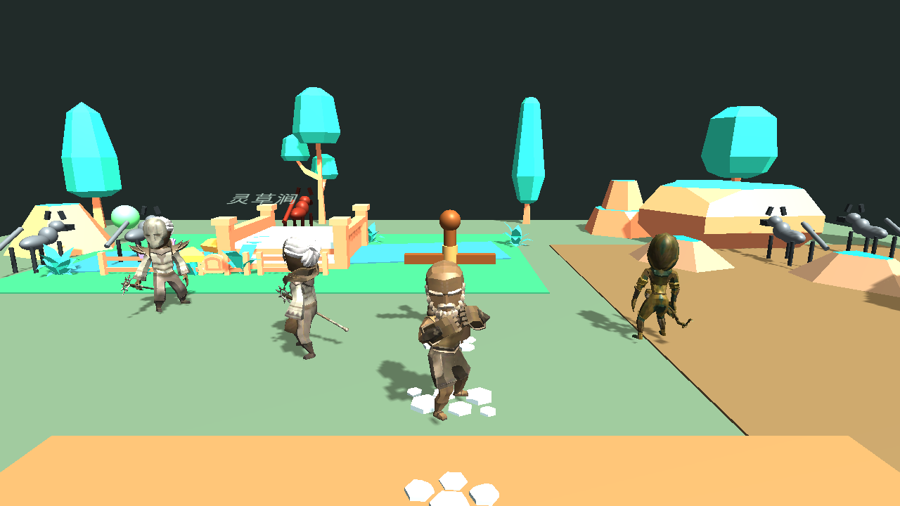
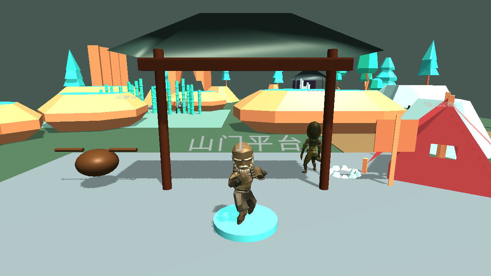
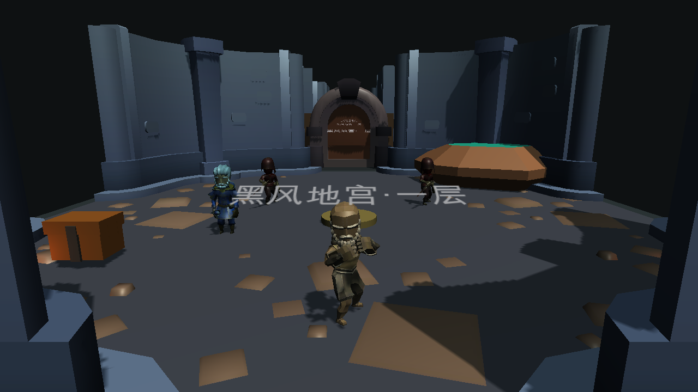

# G08-03 丐版全量 3D 美术运行证据

> 验证日期：2026-07-15  
> Unity：6000.5.3f1 · URP 17.5 · Apple M4 / Metal

## 交付快照

- 精选资源：58 个 FBX、5 张角色贴图、1 张地牢 colormap，共约 18 MiB。
- 授权审计：Quaternius RPG Character Pack、Kenney Nature Kit、Kenney Modular Dungeon Kit 三份原始 CC0 文本。
- 完整性：`Assets/_Project/Art/ThirdParty/SHA256SUMS` 共 67 条内容哈希。
- 运行时：玩家、NPC、人形敌人使用带骨骼低模；狼、精英狼、石将军、木人、民居、箱子、炼丹炉与灯火使用程序化低模兜底。
- 地图：青石为村镇/溪流/训练场；苍梧为松林/山门/洞府/雷台；黑风为五层石室/门廊/火盆/遗迹。

现有灰盒根、碰撞体、NavMesh 输入、任务对象名、内容 ID 和交互组件继续作为玩法权威；新美术只挂在 `BudgetVisual` 子层或无碰撞的 `BudgetArt_*` 场景根下。

## 自动化结果

| 检查 | 结果 |
|------|------|
| Unity 首轮导入/脚本编译 | 通过，0 个 C# error |
| EditMode | 34 / 34 通过 |
| G08-03 目标 PlayMode | 3 / 3 通过 |
| 全量 PlayMode | 205 / 205 通过 |
| macOS Standalone Release | `Succeeded`；127,234,339 bytes；0 error |
| macOS Player Boot 冒烟 | 通过；Unity 6000.5.3f1；无 safe mode / blocking exception |
| 三图真实 Player 启动与截图 | 通过；日志无 NullReference / MissingReference / Crash |

可重复执行：

```bash
./tools/validate_g08_03.sh
```

## 实际 Player 截图

这些 PNG 不是 Blender 摆拍，而是同一 macOS Release Player 通过只在命令行显式启用的展示入口加载对应玩法场景后，由 `ScreenCapture` 在 1280×720 下生成。

### 青石原



### 苍梧山脉



### 黑风秘境



## 已知视觉边界

- 这是全局可玩替身，不是终稿：地表仍平、模块拼接明显、角色没有接入正式 Animator Controller，材质主要是统一低模色块。
- Quaternius 角色保留骨骼与动画片段，但本 Goal 没有做全量动画重定向；动作精修仍需独立 Goal。
- 原 `G08-02` 主角静态重制保持 `implemented`，不冒充用户已认可的终稿。
