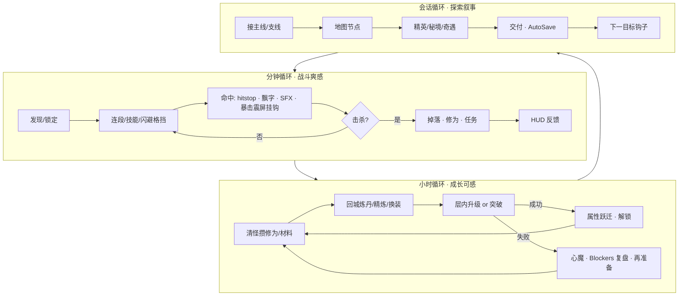
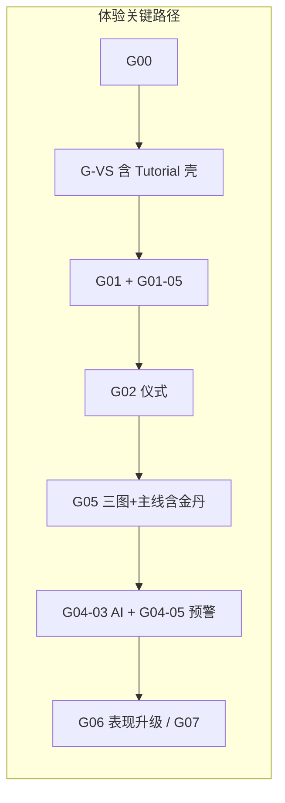
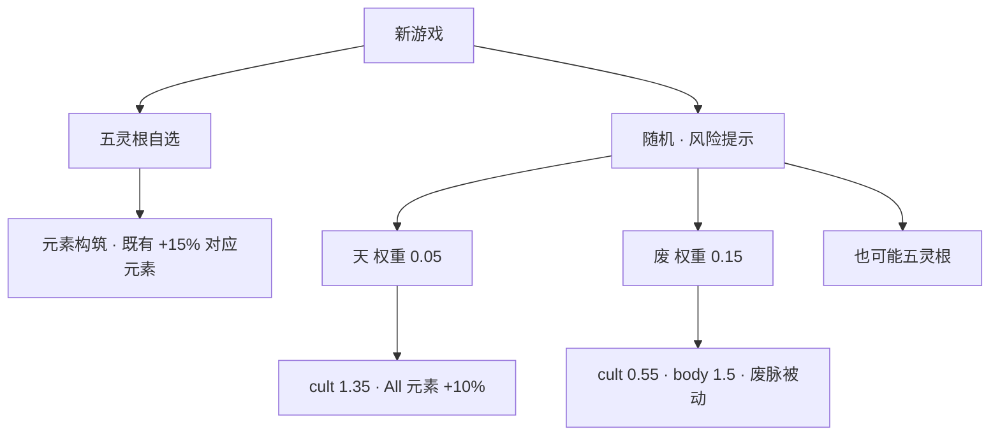

# 《问道长生》游戏规格全面优化设计

> **实现状态警告**：本文是已批准的设计决策与历史提案，不是开发进度源。
> 文中的 `status: pending`、PR 顺序和“尚未落地”措辞保留用于溯源，当前开发位置
> 只认 [`../10_PROGRESS.md`](../10_PROGRESS.md)，Goal 卡片状态只认
> [`../10_GOALS.md`](../10_GOALS.md)。

| 字段 | 内容 |
|------|------|
| **文档标题** | 设计感 · 完整性 · 游戏性 三维优化方案 |
| **作者** | Design Agent + Owner 确认 |
| **日期** | 2026-07-14 |
| **状态** | **Approved（Rev.2.3）** — OQ-A…E 已由 Owner 拍板 |
| **基线版本** | 规格库 v3.0（`docs/00`–`10` + `AGENTS.md`） |
| **适用终点** | MVP：金丹初 + 黑风秘境 + 主线第一章《青石问道》 |
| **技术锁定** | Unity 6000.5.3f1 · URP 17.5 · C# · Input System · 单机 JSON 存档 · 网络仅接口 |
| **就绪声明** | **产品设计方向 + 规范性补丁附录**。代码实现须在 **文档 PR 列车（PR-0…8）合并后** 再开 Goal；本文附录六段桩足够文档 PR 作者粘贴进 `0x`，**不替代**落地后的系统规格权威源。 |

---

## Overview

现有规格仓库（`docs/00`–`10`）已具备 **AI Goal 可执行性**：Schema / StateMachine / API / Pipeline / EdgeCases / Acceptance 六段齐全，垂直切片与 Phase 依赖清晰。但作为**仙侠第三人称 ARPG** 的产品规格，它偏「工程可实现」，在三方面仍有系统级缺口：

1. **设计感（Fantasy / Feel）**：主题多停留在 ID 与数值表，缺少贯穿命名、文案语气、场景情绪、突破仪式、镜头/VFX/音频**体验意图**与玩家情绪曲线。
2. **完整性（Completeness）**：系统间存在「能跑但不成环」的断点——战斗手感指标、难度/经济节奏、失败重试、信息架构、灵根路线的**可玩差异**、主线情感节拍（含**金丹**破境）、RealmConfig 材料接线错误等。
3. **游戏性（Gameplay）**：核心乐趣被拆成子系统清单，缺少「分钟/小时/会话为何还想再开一把」的闭环论证；BOSS 反制、风险收益、决策树偏薄。

本方案**不推翻 v3.0 技术骨架**，而是叠加 **体验规格层**，补齐闭环与**可粘贴的规范性字段/验收**，并给出文档修订清单与 PR Plan。实现期仍遵守 Goal 模式；MVP 终点维持「金丹初 + 黑风秘境 + 主线一章」。

**与 Goal 模式关系**：本文是 change proposal；`00§0.3` 六段权威在文档 PR 写入 `03`–`08` 之后生效。在 PR-8 合并前，**禁止**以 G-VS-08 / 体验增强 acceptance 做最终切片验收。

---

## Background & Motivation

### 当前状态（基线优点）

| 维度 | 已具备 |
|------|--------|
| 工程可执行 | EventBus / ServiceLocator / 存档分模块 / asmdef 分层（`02`） |
| 战斗骨架 | 四连击倍率、闪避无敌、**后摇可闪避取消**（`04§2` 已有）、元素反应表、伤害管道 |
| 修仙骨架 | 灵根倍率、层内升级、突破掷骰、炼体、RealmConfig（`05`/`03`） |
| 内容表 | 主线 10 环、三图、敌人/物品/成就 ID（`09`） |
| 开发节奏 | Phase 0→VS→1–7 原子 Goal（`10`） |

### 痛点（产品层）

| # | 痛点 | 证据 | 修正方向（本 Rev） |
|---|------|------|-------------------|
| T1 | 「修仙感」缺仪式管道 | 突破 3s + Result 1.5–2s；无分镜 | 五拍**演出时间线**绑在 2 态状态机上 |
| T2 | 灵根只有乘数 | Waste `0.55/1.5`，Heaven `1.35`；无被动字段 | **规范性被动表 + 验收**（§5.2） |
| T3 | 手感无量化验收 | G01 验倍率/i-frame，无 buffer/hitstop **挂钩验收** | Feel Package 数字落在 `04§4.8`；G01-05 独立 Goal |
| T4 | 经济粗糙 | `09§13` 无抽测程序 | 平衡检查清单（§10） |
| T5 | 教程与切片错位 | G06-02 vs VS 八步 | **单一完成态存储**，VS 日起壳 |
| T6 | BOSS 缺可读预警参数 | `07§3.3` 仅技能列表；P3 有 VFX ID 但无 struct | 完整 `BossSkillTelegraph` + G04-05 |
| T7 | 探索机缘薄 | 宝箱指标有，奇遇结构无 | Serendipity 定义/边界 |
| T8 | 情绪曲线缺金丹峰 | 主线 07–08 仅筑基；金丹门槛未编排 | **KD-13** 主线金丹节拍 + 基线勘误 |
| T9 | 系统堆叠 | 日常/声望并列 | 日常降权（KD-8 维持） |

### 基线勘误（设计必须先修的规格 bug）

| Bug | 位置 | 正确接线 |
|-----|------|----------|
| 筑基丹/凝金丹接线 | `03` RealmConfig 材料挂错/双挂 | realm1→2=`item_pill_foundation`；realm2→3=`item_pill_goldencore`；**realm3→4 `breakthroughToNext=null`**（勿再挂凝金丹） |
| 失败复盘文案 | 旧稿用「缺筑基丹」笼统举例 | 按 `GetBreakthroughBlockers()` 返回的真实 `requiredItemId` 与获取途径 |
| 小时循环写打坐 | `01§2.2` 仍提打坐 | MVP 改为 **战斗/任务/丹药**；打坐维持 `05§5` 延后 |
| 主线时长字符串 | 本文曾写 2.5–4h，G07-02 写 2–4h | **统一为 2–4h**（粗测） |
| 五灵根 +15% | 已在 SpiritRootConfig | **保留数值**，本方案只产品化文案 + 推荐功法，**不宣称新数学** |
| 闪避取消 | `04` 已有 | Feel 只补 **buffer/hitstop/镜头挂钩**，不把取消窗写成新机制 |

### 为何现在做

规格仓库几乎尚无 Unity 玩法代码——**改文档成本 ≪ 改实现**。在 Phase VS 全面开工前锁定体验层与基线勘误。

---

## Goals & Non-Goals

### Goals

1. 定义 **四大体验支柱 → 机制 → 内容 → 验收** 的可追溯映射。
2. 补齐 **核心循环、情绪曲线（含金丹）、系统依赖、玩家决策树**。
3. 灵根三分：**规范性被动 + 可测 acceptance**（非口号）。
4. 战斗手感、突破仪式、BOSS 预警 Schema、经济抽测程序、失败复盘 API。
5. 文件级修订清单 + Goal **硬拆分规则**与计数更新。
6. 砍/延后清单的游戏设计理由。
7. 附录：Serendipity / Feel / Ceremony / Checkpoint 的六段桩，供文档 PR 粘贴。

### Non-Goals

- 不在本文件直接改仓库内 `docs/0x`（由 PR-0…8 落地）。
- 不实现 Unity 代码、不产出正式美术/配音。
- 不开放联机、元婴玩法、完整炼器/制符/阵法 UI、钓鱼家园。
- 不引入魂系韧性条 / MVP 完美闪避 / Narrative Director。
- **不把 `11_FANTASY_FEEL.md` 当作 Goal 实现入口**（`refs` 仍以系统文档章节为主，`11` 仅体验意图）。
- 不做运行时 FeatureFlags 配置体系（MVP 用常量默认值）。

---

## Key Decisions

| ID | 决策 | 理由 |
|----|------|------|
| **KD-1** | 体验层 = 各系统文档补丁 + `docs/11_FANTASY_FEEL.md`（**意图 only**）；数值/参数权威在 **`03`/`04`/`05`/`09`** | 避免双源；Goal 不从 11 开工 |
| **KD-2** | MVP 终点不变：金丹初 + 黑风通关 + 主线一章；主线粗测时长 **2–4h**；垂直切片 **25–40min** | 与 G07-02 / `01§8` 对齐 |
| **KD-3** | 灵根可玩差：五=元素构筑（**既有** elementBonus）、废=炼体硬刚（**新增被动字段**）、天=高修速+全元素轻加成（既有 mul，随机 only） | T2；见 §5.2 规范表 |
| **KD-4** | 手感包：Input Buffer **120ms**、L1/L2 hitstop **30ms**、L3/L4 **50–70ms**；暴击/反应 **强制挂钩** 已有震屏表；**不**把闪避取消当新功能 | 取消已在 `04`；补可测挂钩 |
| **KD-5** | 突破五拍是 **`TryBreakthrough` 协程内的演出时间线**；逻辑状态保持 **BreakingThrough + BreakthroughResult 两态**；**不新增** `OnBreakthroughPhase` 事件 | 减 EventBus 噪音；UI 读 Manager 属性即可 |
| **KD-6** | 奇遇 = **叙事向 once-only**（对话或独特奖励），与普通宝箱 loot 分离；奖励 **仅** 材料/灵石/lore Flag/功法残页，**不掉装备** | 经济可控（KD-9） |
| **KD-7** | **单一教程完成态**：VS 日起实现 `TutorialManager` 壳（`TryStart`/`Complete`/`HasCompleted` + `world.json`）；G06-02 **只升级表现**（遮罩挖洞），已完成 ID **不重播** | 消除双轨 |
| **KD-8** | 日常降权：G05-05 保留 **框架 API + 2 条日常**（hunt/gather），不作为第一章卡点；**不**再砍掉 G05-05 整卡 | 单机叙事优先 |
| **KD-9** | 经济「丹药中轴」；奇遇不进装备池 | 防膨胀 |
| **KD-10** | BOSS 可读战：完整 `BossSkillTelegraph` Schema；实现放在 **G04-05**（不塞爆 G04-03） | 工时诚实 |
| **KD-11** | **硬拆分规则**：任何使 Goal 预估新增 **>1h** 的 acceptance 必须 **新 Goal 或上调 est_hours 并写明**；**禁止**把 G01-05/G05-06/G04-05 并回父 Goal | 解自相矛盾 |
| **KD-12** | UI 文案「文言轻描 + 现代可读」；必出字符串见 §13.5；**key 策略见 KD-26** | 可实现绑定 |
| **KD-13** | **金丹主线节拍**：`quest_main_01_09` 扩展为「获凝金丹 → **金丹突破**（可失败）→ 再入黑风」；黑风入口硬门槛 `Realm >= GoldenCore`（SubStage 初）。筑基仍在 07–08 | 闭合 P2 第二记忆点与地图推荐境界 |
| **KD-14** | **RealmConfig 材料勘误**：realm1→2=`item_pill_foundation`；realm2→3=`item_pill_goldencore`；**realm3 `breakthroughToNext = null`**（元婴玩法不做，仅保留 xp/stats 占位）。失败不消耗材料（维持 `05` MVP） | 避免凝金丹双挂；闭合元婴不做 |
| **KD-15** | 创角：五灵根自选；天/废 **仅随机**（维持 `05§2`，**不**开放废自选） | 关闭 OQ-1 |
| **KD-16** | 突破辅助丹：**MVP 成功率加成 = 0**，不进配方表 | 关闭 OQ-3 |
| **KD-17** | 筑基 pity：`quest_main_01_08` **接取时**置 `questFlag_main_foundation_pity`；首次在 Flag 仍在时 `TryBreakthrough` 且 `CanBreakthrough` 通过 → `successRate=1.0` 并 **消费 Flag**（无论成功/失败路径：成功必成故只走成功；若因异常未掷骰则不消费——规范：仅在进入 BreakingThrough 结算掷骰前消费）。**材料/脱战等 CanBreakthrough 检查不变**。若接取 08 时已是 Foundation+，直接推进境界目标、**不置 pity**。金丹 **无** 保底 | 关闭 OQ-5；边界见 §7.3 |
| **KD-18** | 死亡惩罚维持 **当前层修为 5%**、不掉装（`01§6`） | 关闭 OQ-6 |
| **KD-19** | 文档冲突序：`01 不做清单 > 03/09 数值权威 > 系统文档机制 > 11 体验意图 > 内容文案`；写入 `AGENTS.md` | 对齐工程规则 |
| **KD-20** | MVP **不做** FeatureFlags.json；手感/奇遇等用 **代码常量或 Config 默认字段**（可在 G00-05 随 JSON 默认加载）。Dungeon：`world.json` 持久化 checkpoint；泉水 flags **本局** | 简化启动路径 |
| **KD-21** | 土灵根 `bodyMul 1.15` **保留**为轻度偏向；废路线靠 **被动 + 1.5 bodyMul** 显著区分，文案避免「唯一炼体根」 | 防幻想撞车 |
| **KD-22** | 无完美闪避、无韧性条、无 Narrative Director（采纳 Alternatives C，否决 B/D） | 范围控制 |
| **KD-23** | 黑风 `dungeonCheckpoint` **每层** 0–4 整数契约（`N` → 再进 B(N+1)；通关 B(k)→`max(N,k)`） | Owner 2026-07-14 确认原 OQ-A |
| **KD-24** | 天灵根 UI：创角/结果用文案「修炼速度显著提升」；**进阶/角色面板可显示确切 `cultivationMul`（1.35×）** | Owner 确认原 OQ-B |
| **KD-25** | MVP 手柄覆盖：**战斗 + HUD + 背包 + 对话** 必做完整导航；炼丹/地图等面板 **允许键鼠优先**（不阻塞 MVP） | Owner 确认原 OQ-C |
| **KD-26** | 新增 UI 文案 **必须有 localization key**；中文 hardcode 为该 key 的 default value（非「可后补 key」） | Owner 确认原 OQ-D；与 KD-12 语气指南并用 |
| **KD-27** | 石将军 **练习模式 Post-MVP**；MVP 仅 Development `/spawn`（及既有 Debug 命令） | Owner 确认原 OQ-E |

---

## Proposed Design

### 1. 体验支柱 → 机制 → 内容 → 验收映射

| 支柱 | 玩家一句话 | 关键机制 | MVP 内容锚点 | 可勾选验收 |
|------|------------|----------|--------------|------------|
| **P1 爽快战斗** | 「打一下就想再打」 | 四连+**已有**取消、**buffer/hitstop**、锁定镜头、元素反应、BOSS 预警 | 灰狼→灰爪→石将军 | G01-05 buffer/hitstop；G04-05 每阶段 ≥1 预警 |
| **P2 修仙成长** | 「破境我变强了」 | 层内小反馈、五拍演出、筑基保底一次、**金丹主线破境**、炼体被动 | 练气→筑基→金丹初 | G02-01 仪式+Blockers；G05-04 金丹节拍 |
| **P3 探索机缘** | 「那边有东西」 | 采集、宝箱、**叙事奇遇** | 灵草涧、云雾谷、隐士 | G05-06 once Flag；不与普通箱混淆 |
| **P4 生活副业** | 「炼丹再出门」 | 炼丹/采集 | 主线 04 强制炼丹 | 材料闭环 |

优先级：**P1 > P2 > P3 > P4**。

---

### 2. 核心循环（强化版）

#### 2.1 三层循环



**小时循环文案（写入 `01` 时）**：`清怪攒修为与材料 → 丹药/任务推进 → 尝试突破`——**删除打坐**。

#### 2.2 再玩一把钩子

| 尺度 | 钩子 | 落点 |
|------|------|------|
| 会话末 | 任务追踪 + 距突破 XP | HUD / 角色面板 |
| 跨会话 | meta：境界、地图、`mainQuestIndex` | `meta.json` |
| 未闭环风险 | 心魔剩余、黑风 `checkpointFloor` | profile / world |
| Build | 灵根被动差异 → 想开第二周目 | 创角文案 + `ach_waste_body` |

#### 2.3 单次会话 45–75 min（建议）

| 分钟 | 活动 | 情绪 |
|------|------|------|
| 0–10 | 补给、任务、检查突破 | 计划 |
| 10–35 | 野外+采集+支线 | 心流 |
| 35–50 | 精英/秘境 | 紧张 |
| 50–65 | 突破 / BOSS | 高峰 |
| 65–75 | 交付、炼丹、存档 | 回落 |

---

### 3. 情绪曲线与章节节拍

#### 3.1 主线第一章（含金丹）

```mermaid
xychart-beta
  title 第一章《青石问道》情绪强度（示意 1-10）
  x-axis [开场,猎狼,灰爪,炼丹,开秘径,盘山,筑基,金丹,入秘境,石将军,尾声]
  y-axis "情绪强度" 0 --> 10
  line [3, 4, 7, 5, 6, 6, 9, 9, 7, 10, 8]
```

| 节拍 | QuestId | 设计意图 | 必须体验 |
|------|---------|----------|----------|
| 起 | 01 | 觉醒 | 灵根文案三路线；授引气诀 |
| 承 | 02 | 战斗落地 | 连招+掉落 |
| 小高潮 | 03 | 精英 | 灰爪冲锋预警（基础） |
| 缓冲 | 04 | 生活环 | 炼丹强制成功路径 |
| 推进 | 05 | 世界变大 | 远眺苍梧；BGM 切换 |
| 试炼 | 06 | 横向难度 | 滚石；筑基暗示 |
| **高潮 A** | 07–08 | 筑基 | 五拍仪式；**首次保底成功**（KD-17）；飞剑钩子 |
| **高潮 A2** | **09 前段** | **金丹** | 获 `item_pill_goldencore` → 金丹突破（**可失败**）→ 属性跃迁 |
| 压迫 | 09 后段 | 入黑风 | 硬门槛金丹初；氛围转暗 |
| **高潮 B** | 10 | 石将军 | 三阶段预警+斩杀 |
| 尾声 | 完结对话 | 二章钩子 | 拓跋渊；存档建议 |

**主线 09 规格补丁（写入 `03`/`07`/`09`）**：

```text
quest_main_01_09 目标（有序）：
  1. Collect item_pill_goldencore
     - Accept() 时发放：QuestData.AcceptRewards 含 item_pill_goldencore ×1
       发放者叙事：npc_yaolao（TurnInNpcId / Start 对话仍为药老）
     - 进度 = LatchOnFirstAcquire：grant 或 OnItemAcquired 首次即锁存
       （突破耗丹后不回退）
     - MVP 商店不卖 / 不无限购凝金丹
     - AcquisitionHintKeys: ["hint_quest_main_09_yaolao"]
  2. ReachRealm GoldenCore（见下）
  3. Reach location blackwind_entrance
入口：未金丹 → ui_blackwind_gate；硬门槛。
```

**主线 07/08 筑基丹（与凝金丹对称）**：

```text
quest_main_01_07 完成（TurnIn）或 quest_main_01_08 Accept（二选一，规范默认）：
  - 默认：quest_main_01_08 AcceptRewards 授予 item_pill_foundation ×1（npc_yaolao）
  - 若 07 TurnIn 已发过则 08 不再重复发（quest flag foundation_pill_granted）
  - Collect 目标若存在：LatchOnFirstAcquire=true
  - MVP 商店不无限售筑基丹（不卖或限购 1，规范默认：杂货店不卖）
  - AcquisitionHintKeys: ["hint_quest_main_08_yaolao"]
  - 08 Accept 另置 pity Flag（§7.3）
```

**数据层必增**（PR-4）：

```csharp
// 03 enum
public enum ObjectiveType {
    Kill, Collect, Talk, Reach, UseItem, Craft, Survive,
    ReachRealm  // TargetId = RealmType.ToString() e.g. "GoldenCore"
}

// QuestData 扩展
public QuestReward AcceptRewards;  // 可空；Accept() 成功后立即发放（物品/灵石/XP）
// 既有 Rewards 仍为 TurnIn 奖励

// QuestObjective 扩展
public bool LatchOnFirstAcquire; // Collect：首次满足后不因 RemoveItem 回退；突破材料默认 true

// 07 QuestManager
public void NotifyRealm(RealmType newRealm);
// Accept 管道：校验 → Active → 若 AcceptRewards 非空则 Inventory 发放 → 评估 Collect latch
// OnRealmBreakthrough → Success && NewRealm >= required → ReachRealm 进度
// Edge: 不可重复 Accept（基线）；AcceptRewards 只发一次
```

#### 3.2 新手套前 15 分钟

1. 选灵根（三路线文案，数字对五/天/废诚实）  
2. 移动反馈（占位即可）  
3. 第一击：伤害字 + **可选** 30ms hitstop（VS 最小集）  
4. 击杀修为飘字  
5. 对话镜头  
6. 回血丹（满血不消耗）

---

### 4. 系统依赖



---

### 5. 玩家决策与灵根规范

#### 5.1 创角决策树



#### 5.2 灵根规范性表（落地 `03` SpiritRootConfig + `05`）

**既有乘数（保留，不改数学除非注明）**：

| Root | cultivationMul | bodyMul | elementBonus |
|------|----------------|---------|--------------|
| Metal/Wood/Fire | 1.1 | 1.0 | 对应元素 0.15 |
| Water | 1.1 | 1.0 | **Water 0.15 + Ice 0.10**（基线 JSON，禁止「简化」掉 Ice） |
| Earth | 1.1 | **1.15** | Earth 0.15 |
| Heaven | 1.35 | 1.0 | All 0.10 |
| Waste | 0.55 | **1.5** | 无 |

> **权威源**：上表为摘要；完整字段以 `03` SpiritRootConfig.json 为准。PR-5 不得覆盖 Water 的 Ice 附加。

**新增字段（JSON / 运行时）**：

```json
{
  "type": "Waste",
  "uniquePassiveId": "passive_waste_iron_vein",
  "introDescriptionKey": "root_intro_waste",
  "passives": {
    "blockPhysDrBonus": 0.10,
    "physicalDamageBonus": 0.10,
    "bodyPotionMul": 1.25,
    "grantPassiveSkillIdOnCreate": null
  }
}
```

| Root | uniquePassiveId | 被动效果（规范默认） | 内容绑定 |
|------|-----------------|----------------------|----------|
| 五系 | `passive_element_affinity` | **无额外字段**；沿用 elementBonus；创角 UI 推荐对应技能 | `PreferredRoots` 在 SkillData 可选标注 |
| Earth | （无 unique，用 bodyMul） | 已有 bodyMul 1.15；**不**给废级格挡加成 | 文案：厚土稳健 |
| Waste | `passive_waste_iron_vein` | 格挡见下节；普攻/重击/无元素技能伤害 **+10%**；锻体丹炼体 XP **×1.25** | `dlg_main_01_01` 废脉句；`ach_waste_body` |
| Heaven | `passive_heaven_gift` | **无战斗额外被动**；仅既有 cult/element；UI 稀有金框 | 随机结果 Toast |

##### 废灵根格挡管道（规范）

- 基线格挡物理减伤 `BaseBlockPhysDR = 0.60`（`04` 格挡表）。
- 废被动：`BlockPhysDR_final = min(0.85, BaseBlockPhysDR + blockPhysDrBonus)` 且 `blockPhysDrBonus=0.10` → **`BlockPhysDR_final = 0.70`**。
- **施加点**：伤害管道 **step 8（格挡/护盾）**，格挡成功之后、炼体物理 DR（step 9）之前；`PlayerStats.GetBlockPhysDr()` 供 CombatSystem 查询。
- **不**用独立乘区叠乘（避免 0.60×1.10 歧义）。

**铁肤 `skill_pass_iron_skin`**：维持 `09`——**炼体 1 阶奖励**，全灵根可学。废灵根**不**白送，但因 body 升级更快，**更早**拿到（可玩差异来自节奏而非白嫖）。

**Heaven / Waste 不可创角点选**（KD-15）。

**可测 acceptance（每路线一条，禁止人口死亡率）**：

| 路线 | Goal | Acceptance |
|------|------|------------|
| Fire | G-VS-05 | 日志：`cultivationMul=1.1`，火伤 bonus 0.15 作用于火技能 |
| Waste | G02-02 | Body XP ≥ 五系对照 ×1.5；锻体丹 XP ×1.25；格挡时 `BlockPhysDR_final==0.70`（对照五系 0.60）；同次木桩物理命中实伤约为对照的 `(1-0.70)/(1-0.60)=0.75` 倍 |
| Heaven | G-VS-05（随机种子测） | `cultivationMul=1.35` 可测；创角文案非裸数字，**角色/进阶面板显示 1.35×**（KD-24） |

---

### 6. 战斗手感规格（数字权威 → `04§4.8`）

| 参数 | MVP 默认 | 说明 |
|------|----------|------|
| Input Buffer | 120 ms | 攻击/闪避/技能 |
| Hitstop L1/L2 | 30 ms | |
| Hitstop L3/L4/重击 | 50–70 ms | |
| Hitstun 普通敌 | 0.12–0.25 s | 精英 ×0.5 |
| 暴击震屏 | 0.5 / 0.15s | **`04` 已有表 → 强制 Crit 调用** |
| 元素反应 | FOV +2 回弹 0.2s + 彩色字 | 可见性 |
| 闪避取消 | — | **已有**，本包不重复立项 |
| 完美闪避 | — | MVP 不做（KD-22） |

归属：**G01-05**（独立，est 3h），不并入 G01-01。

VS 最小集（**G-VS-02**）：伤害字必做；hitstop 30ms **可选占位**（同一参数入口，默认开）。

---

### 7. 突破仪式（演出时间线 + 数据管道）

#### 7.1 状态机（逻辑，维持 2 态）

| 状态 | 时长 | 行为 |
|------|------|------|
| Idle | — | |
| BreakingThrough | **3.0 s** 无敌 | 演出拍 1–3 |
| BreakthroughResult | **1.5–2.0 s** | 演出拍 4–5 + 结算 |

#### 7.2 五拍映射（纯表现，不增加 GameState 除非标注）

| 拍 | 时间轴（相对 TryBreakthrough 成功进入后） | 表现 | 逻辑 |
|----|------------------------------------------|------|------|
| 1 准备 | 0–0.3s | 锁玩家战斗输入；**不**切 `Cutscene`（可 Esc 开 Pause，Pause 则暂停协程） | 已通过 CanBreakthrough |
| 2 聚气 | 0.3–1.8s | 法阵 VFX、镜头缓推 | BreakingThrough |
| 3 天象 | 1.8–3.0s | 天色/粒子、震屏渐进 | 3.0s 点掷骰 |
| 4 结果 | Result 态 0–1.2s | 成功金光 / 失败黑气；`OnRealmBreakthrough*` | 结算 XP/材料/心魔 |
| 5 余韵 | Result 1.2–2.0s | 属性对比面板；解锁 Toast | Recalculate |

**不发布** `OnBreakthroughPhase`。UI 可 `CultivationManager.CeremonyBeat {get;}` 只读轮询或结果事件后刷。

**GameState**：保持 `Playing` + 输入锁；**不**进 `Cutscene`（避免堵 Esc 规则分叉）。

#### 7.3 材料、失败与筑基 pity 边界

- **失败不消耗** `requiredItemId`（基线 MVP）；成功才消耗。  
- **Pity Flag 生命周期（KD-17）**：

| 事件 | 行为 |
|------|------|
| `quest_main_01_08` Accept | 若当前 `Realm < Foundation`：置 `questFlag_main_foundation_pity=true`；若 **已是 Foundation+**：不置 Flag，境界相关目标直接满足/跳过 |
| `GetBreakthroughSuccessRate` | 若 Flag 且目标为筑基突破：返回 **1.0**（仍受 clamp 上界 0.95？**规范：pity 绕过 clamp，强制 1.0**） |
| 进入 BreakingThrough 且通过 `CanBreakthrough`（含材料、脱战 5s 等 **全部不变**） | **消费 Flag**（=false），再播演出；掷骰必成功 |
| 突破失败（非 pity 路径） | 不消耗材料；无 Flag 时按公式 |
| 金丹突破 | **永不**读筑基 pity Flag |
| **场景卸载 / 强制中断**（已消费 Flag、尚未完成掷骰结算；含基线「突破中卸载→强制失败不扣 XP」） | **恢复 `questFlag_main_foundation_pity=true`**，不扣材料、不扣 XP；玩家可再次 TryBreakthrough 仍享 pity |

- 玩家在 08 前用 GM/刷满自行筑基：接 08 时走「已 Foundation」分支，任务叙事用药老确认句，不强制再破一次。

#### 7.4 API 补丁

```csharp
public struct BreakthroughBlocker {
    public string Code; // NotMaxSubStage, MissingItem, InCombat, WrongState, ...
    public string MessageKey;
    public string RelatedItemId; // 可空
    public string[] AcquisitionHintKeys; // 来自物品表
}

// CultivationManager
public IReadOnlyList<BreakthroughBlocker> GetBreakthroughBlockers();
public float GetBreakthroughSuccessRate(); // 含 pity
public int CeremonyBeat { get; } // 0=none, 1-5 演出中

// 失败 Toast 数据：SuccessRate, Blockers 在失败时仍给「下次建议」,
// HeartDemonRemaining, XpNeededEstimate
```

`09` 对 `item_pill_foundation` / `item_pill_goldencore`：

```text
AcquisitionHintKeys: ["hint_quest_main_foundation", "hint_shop_yaolao"] 等
```

#### 7.5 RealmConfig 勘误（规范 · PR-0 必贴）

```json
// realm 1 练气 → 筑基
"breakthroughToNext": {
  "baseSuccessRate": 0.85,
  "minSubStage": 9,
  "failXpPenaltyPercent": 0.2,
  "requiredItemId": "item_pill_foundation"
}

// realm 2 筑基 → 金丹
"breakthroughToNext": {
  "baseSuccessRate": 0.65,
  "minSubStage": 3,
  "failXpPenaltyPercent": 0.2,
  "requiredItemId": "item_pill_goldencore"
}

// realm 3 金丹 → 元婴：MVP 不做玩法
"breakthroughToNext": null
// 仍保留 realm 3 的 subStages / xp / baseStats 供金丹初属性与展示；
// TryBreakthrough 在无 breakthroughToNext 时 CanBreakthrough=false
```

**禁止**在 realm 3 再挂 `item_pill_goldencore`（避免同一丹服务两次破境）。

---

### 8. 探索机缘

#### 8.1 定义

| 类型 | 是奇遇？ | 说明 |
|------|----------|------|
| 叙事 Trigger + 对话/独特奖励 + Once Flag | **是** | SerendipitySystem |
| 普通宝箱随机 loot | **否** | 现有 chest |
| 隐士支线任务 | **否**（任务系统） | 可被奇遇**引到**接任务 |
| 云雾谷宝箱 | 默认否；若配置 `serendipityId` 则升格 | |

#### 8.2 Schema

```csharp
public class SerendipityData : ScriptableObject {
    public string Id;
    public string MapId;
    public string TriggerId;
    public bool OnceOnly;              // MVP 恒 true
    public string RequiredQuestId;     // 可空
    public RealmType RequiredRealm;    // 用枚举，不用裸 int
    public QuestReward Rewards;        // 禁止 Equipment 类型条目（校验）
    public string DialogueId;
    public string WorldFlag;
}
```

#### 8.3 数量与 Goal（系统归属单一，防最小编号踩坑）

| 地图 | 数量 | acceptance 归属 |
|------|------|-----------------|
| 青石 | ≥1 | **G05-06** |
| 苍梧 | ≥2 | **G05-06** |
| 黑风 | ≥1 | **G05-06**（含 B 层 Trigger 摆放；地图场景已由 G05-03 存在） |

**规范 Goal 图（PR-8 必写，二选一已拍板）**：

```text
G05-03  // 仅秘境流程：5 层、机关、泉、BOSS 入口/重置、checkpoint、泉水 run
         depends_on: [G05-02, G04-03]
         不含任何 Serendipity 验收

G05-06  // SerendipitySystem 唯一实现方 + 全部内容
         depends_on: [G05-01, G05-02, G05-03]
         deliverables: SerendipitySystem + SO/触发器（青石≥1、苍梧≥2、黑风≥1）
         acceptance: 三图 once + Flag 存档 + 无装备奖励
```

**为何不采用「G05-03 depends G05-06」**：最小 pending ID 下 G05-03 会先于 G05-06 被领取，系统未就绪却要验黑风奇遇。  
**采用「G05-06 挂在 G05-03 之后」**：秘境灰盒先通；奇遇系统与四条内容一次交付，无双路径。

#### 8.4 EdgeCases

| 条件 | 行为 |
|------|------|
| 战斗中踩触发器 | 延迟至脱战 1s 再开对话；或仅播 Flag 奖励无对话 |
| 背包满 | 奖励掉地 180s（同 Inventory） |
| 已触发 | 不再 Enter |
| 读档 | Flag 恢复，不重复 |
| 奖励含装备（误配置） | Editor 校验失败 / 运行时剥离并 LogError |

事件：`OnSerendipityTriggered` → `02§5.2` 登记。

---

### 9. BOSS：预警 Schema 与 Goal 拆分

#### 9.1 `BossSkillTelegraph`（写入 `03`）

```csharp
public enum TelegraphShape { Circle, Line, Sector, FullScreen }

[Serializable]
public class BossSkillTelegraph {
    public string SkillId;
    public TelegraphShape Shape;
    public float Duration;          // 预警可读时间，≥0.6 验收用
    public float RadiusOrLength;    // Circle/FullScreen 用 Radius；Line 用 Length
    public float Angle;             // Sector 度数；其它 0
    public string VfxId;            // 如 VFX_Boss_Slam_Warning
    public float RecoverStun;       // 技能后硬直=惩戒窗口
    public bool Interruptible;      // MVP 默认 false
}

// BossPhase 扩展：
// public BossSkillTelegraph[] Telegraphs;
```

石将军表示例：

| 阶段 | SkillId | Shape | Duration | RecoverStun | Vfx |
|------|---------|-------|----------|-------------|-----|
| P1 | boss_sg_slam | Circle | 0.7 | 1.0 | VFX_Boss_Slam_Warning |
| P1 | boss_sg_spike | Circle | 0.6 | 0.8 | （占位） |
| P2 | boss_sg_charge | Line | 0.8 | 1.2 | |
| P2 | boss_sg_summon | Circle | 0.7 | 0.5 | |
| P3 | boss_sg_rage_slam | FullScreen | 1.0 | 1.5 | VFX_Boss_Slam_Warning |

#### 9.2 DamageInfo / DeathInfo

```csharp
// DamageInfo 增加：
public string SkillId; // 可空；来自 DamageRequest.SkillId

// DeathInfo 增加：
public string LastHitSkillId; // 击杀那一下；未知则 ""
```

管道：`DealDamage` 把 `req.SkillId` 写入 `DamageInfo`；致死时拷入 `DeathInfo`。

#### 9.3 Goal

| Goal | est | 范围 |
|------|-----|------|
| **G04-03** | 5 | 三阶段技能差、阶段事件、血条、出圈重置（**不含**完整 telegraph 调参） |
| **G04-05** | 3 | Telegraphs 播放、RecoverStun 窗口、≥0.6s 预警验收 | `depends_on: [G04-03, G01-02]` |

---

### 10. 经济与可验收抽测

**调参指南**（非硬验收，标 `tuning_guide`）：东郊清怪约 20–40 灵石/时；通关结余约 80–200。

**G07-02 硬检查清单**：

1. **练气中经济 15 分钟**：新档 Fire 灵根，主线完成 02 后，仅东郊清怪 15 min（禁 /give），记录 Δ灵石、Δ修为；写入测试笔记。  
2. **通关结余**：主线 10 完成后读 `meta`/inventory 灵石 **∈ [50, 300]**（放宽带，避免过拟合；理想瞄准 80–200）。  
3. **Sink 烟测**：回血丹价 10、精炼石 25 仍可买；不要求清空。  
4. 小时率数字**不**作为 CI 硬失败，除非连续两次通关结余越界。

---

### 11. 失败与秘境存档语义

| 失败 | 惩罚 | 重试 |
|------|------|------|
| 死亡 | 层修为 5%，回传送点 | 跑图+药 |
| 突破失败 | 20% 层修为+心魔；**不扣材料** | Blockers 提示 |
| 炼丹失败 | 按配方 | 再采 |
| 黑风 B5 灭 | BOSS 重置 | **保留** checkpoint |

**Dungeon 状态 · checkpoint 整数契约（冻结 · KD-23）**：

```text
world.json:
  dungeonCheckpoint: { "map_blackwind": int }  // 合法域 0..4，缺省 0

语义（唯一权威）:
  checkpoint N (0..4) = 再入秘境时重生在楼层 B(N+1)
  首次进入: N=0 → 出生 B1
  通关楼层 B(k)（k=1..4）: checkpoint = max(checkpoint, k)
    例: 通关 B2 → checkpoint=2 → 再进出生 B3
  通关 B5（击杀石将军 / 主线 10 完成）: 视为 run complete；
    MVP: checkpoint **保持 4**（便于重刷入口；不挡主线）
  B5 战败: BOSS 重置；checkpoint 不变（若玩家已达 B5 则 N=4，再进仍 B5）

运行时 DungeonRunState（不持久 / 退出清理）:
  potionUsedFlags: { "b4_spring": bool }
  - 主动退出或通关成功：清 potionUsedFlags
  - B5 失败：保留 checkpoint，清泉水旗（泉可再喝）
  - 读档在秘境外再进：新 run，泉可用；checkpoint 从 world 读
```

Edge：中途退出回入口 → checkpoint 持久保留；再进按上表 N→B(N+1)。

---

### 12. 引导与信息架构

#### 12.1 单一 Tutorial 存储

```csharp
// 自 G-VS-01 起可存在的壳
public class TutorialManager : SafeBehaviour {
    public bool TryStart(string tutorialId);
    public void CompleteStep(string stepId);
    public void Complete(string tutorialId);
    public bool HasCompleted(string tutorialId);
    // 持久化：world.json tutorialsCompleted: string[]
}
```

| 阶段 | 表现 | 完成态 |
|------|------|--------|
| VS | Toast + 可选暂停提示 | **写入同一 keys** |
| G06-02 | 遮罩挖洞升级 | `HasCompleted` 则 **skip** |

**G-VS-08** 勾选更新：移动/战斗教程须 `HasCompleted(tut_move/tut_combat)` 或强制走完 Toast 链——**取消**「可后补、先手动会玩」作为完成标准（开发中可 /tutorial_skip 仅 DEVELOPMENT）。

**G06-02 acceptance 强制句**：`若 tut_move/tut_combat 已完成则不重播`。

#### 12.2 信息层级

L0 HUD → L1 任务 → L2 修为/突破红点 → L3 面板 → L4 成就 Toast only。

---

### 13. 仙侠设计感（`11` 意图；ID 绑定如下）

#### 13.1–13.3 语气 / 场景 / 元素

（维持 Rev.1 方向；数字不进 11。）

#### 13.4 音频状态机 ↔ 既有 ID（`09§12`）

| 转移 | BGM ID | 验收 |
|------|--------|------|
| 青石探索 | `BGM_Explore_Qingshi` | 进图 |
| 苍梧探索 | `BGM_Explore_Cangwu` | 进图 |
| 进战 | `BGM_Combat_Normal` | **≤1s** Crossfade（G06-05） |
| 脱战 8s | 回当前 Explore | |
| 石将军战 | `BGM_Boss_StoneGeneral` | 进战圈 |
| 城内 | `BGM_City_Qingshi` | 安全区可选 |

SFX：`SFX_Combat_Hit_*`、`SFX_UI_LevelUp`、突破用 `VFX_Realm_Breakthrough` + 结果 sting（可用 UI 音占位）。

#### 13.5 Must-ship 文案（最少集，写入 `09` 或 Dialogue/UI 表）

| Key | 中文（规范默认） |
|-----|------------------|
| `root_intro_five` | 「五行之力，各有所长。择一深耕，可引元素相生相克。」 |
| `root_intro_waste` | 「废脉难修法，却可锤炼肉身。路途漫长，厚积薄发。」 |
| `root_intro_heaven` | 「天灵罕见，气海充盈。修炼速度显著提升，万事慎傲。」（面板另显 1.35×，KD-24） |
| `ui_death_revive` | 「道消身陨——于最近传送阵苏醒。」 |
| `ui_bt_success` | 「气机凝实，境界更进一步！」 |
| `ui_bt_fail` | 「心魔侵扰，破境未成。整理再战。」 |
| `ui_blackwind_gate` | 「金丹方可踏入黑风秘境。」 |

---

### 14. 砍 / 延后清单

| 项 | 处置 | 理由 |
|----|------|------|
| 炼器/制符/阵法 UI | 延后 | P4 |
| 钓鱼家园宠物 | 不做 | 非支柱 |
| 元婴玩法 | 数据 only | 时间盒 |
| 联机 | 接口 only | |
| 完美闪避/韧性 | 不做 MVP | KD-22 |
| 打坐 | 延后；**01 小时环删除** | 与战斗成长冲突 |
| 日常依赖 | 降权保框架 | KD-8 |
| FeatureFlags 运行时 | **不做** | KD-20 |
| 套装镶嵌结算 | 数据 only | |
| 世界 BOSS | 不做 | 聚焦石将军 |
| 石将军练习模式 | **Post-MVP**（KD-27） | MVP 仅 `/spawn` |

---

## API / Interface Changes

| 变更 | 说明 |
|------|------|
| `OnSerendipityTriggered` | 必登 `02§5.2` |
| **不**加 `OnBreakthroughPhase` | KD-5 |
| `ObjectiveType.ReachRealm` + `QuestManager` 订 `OnRealmBreakthrough` / `NotifyRealm` | §3.1 |
| `QuestData.AcceptRewards` | Accept() 发放；凝金/筑基丹 |
| Collect `LatchOnFirstAcquire` | 突破材料任务 |
| `GetBreakthroughBlockers()` | §7.4 |
| `CeremonyBeat` 属性 | 只读 |
| `PlayerStats.GetBlockPhysDr()` 或等价 | 废被动；管道 step 8 |
| `DamageInfo.SkillId` / `DeathInfo.LastHitSkillId` | 管道补全 |
| `BossSkillTelegraph` + `BossPhase.Telegraphs` | §9 |
| `SaveMetadata.MainQuestIndex` | 主菜单 |
| `TutorialManager` 提前 | §12 |
| `world.json` tutorialsCompleted, dungeonCheckpoint | |
| SpiritRoot `passives` 块 | §5.2 |
| SkillData 可选 `PreferredRoots[]` | 推荐 UI |

---

## Data Model Changes

| 位置 | 变更 | 迁移 |
|------|------|------|
| RealmConfig | 材料接线勘误；realm3 `breakthroughToNext=null` | 无旧档压力 |
| `ObjectiveType` | **+`ReachRealm`** | 枚举扩展 |
| `QuestObjective` | **+`LatchOnFirstAcquire`** | 默认 false；突破材料 true |
| `QuestData` | **+`AcceptRewards: QuestReward`** | 可空 |
| SpiritRootConfig | passives / intro keys | 默认 0 |
| BossPhase | Telegraphs[] | 新 |
| Event structs | SkillId 字段 | 默认 "" |
| world.json | tutorials, dungeonCheckpoint | 缺省空/0 |
| meta.json | mainQuestIndex | 0 |
| SerendipityData | 新 SO | |
| **无** FeatureFlags.json | — | |

---

## Alternatives Considered

| 方案 | 结论 |
|------|------|
| A 纯文案润色 | 否决为主方案；润色作子集 |
| B 魂系韧性+完美闪 | 否决（KD-22） |
| **C 体验横切+最小机制** | **采纳** |
| D Narrative Director | 否决；Cutscene 仅预留 |

权衡已落入 KD-4/5/7/10/11/13/20/22。

---

## Security & Privacy

单机本地 JSON；损坏标记删除；Debug 命令仅 Development。无账号、无上传。**从略。**

---

## Observability

- EventBus 开发日志；`/feel` 打印 buffer/hitstop 常量。  
- **AnalyticsLog CSV：G07-03 `out_of_scope` 可选**，非 MVP 必做。  
- 验收录屏：VS、筑基仪式、金丹、石将军预警。

---

## Rollout Plan

| 阶段 | 内容 |
|------|------|
| **Doc train** | PR-0…8 全部合并 → **文档冻结 v3.1** |
| **Code** | 仅按 `10_GOALS`；下列「实现 PR」= Goal 内示例提交说明，**不是**第二套 backlog |
| R-VS | Tutorial 壳 + 伤害字 + 可选 30ms hitstop（G-VS-*） |
| R-Feel | G01-05 完整手感包 |
| R-Cult | G02 仪式 + Blockers + pity |
| R-World | 金丹节拍、checkpoint、奇遇 |
| R-Boss | G04-05 预警 |

**门禁**：`PR-8 合并前禁止 G-VS-08 最终体验验收`；`PR-0`（基线勘误）必须先于任何突破相关实现 Goal。

---

## 对现有 `docs/0x_*.md` 的具体修订清单

| 文件 | 修订 |
|------|------|
| **`00_INDEX`** | v3.1；地图+`11`；冲突序；`11` 免六段、非 Goal 入口 |
| **`01_VISION_MVP`** | 支柱体验列；小时环**删打坐**；时长 2–4h；金丹节拍；切片手感最小集；术语奇遇 |
| **`02_ARCHITECTURE`** | 事件 Serendipity；SkillId 字段说明；world/meta；Tutorial 存档；**无** BreakthroughPhase 事件 |
| **`03_DATA_LAYER`** | RealmConfig 勘误（realm3 null）；`ReachRealm`；`LatchOnFirstAcquire`；**`QuestData.AcceptRewards`**；SpiritRoot passives；Water Ice；Telegraph；SerendipityData；SkillId；checkpoint |
| **`04_PLAYER_COMBAT`** | **§4.8 Feel Package 数字权威**；Crit/反应挂钩；注明取消已有 |
| **`05_CULTIVATION`** | 演出时间线映射；Blockers API；pity；灵根被动表；失败不消耗 |
| **`06_ITEMS_EQUIP_SKILL`** | PreferredRoots；AcquisitionHintKeys 消耗品 |
| **`07_WORLD_ENEMY_QUEST`** | 奇遇+Edge；checkpoint **整数契约**；`NotifyRealm`/ReachRealm 管道；BOSS Telegraph；金丹门 |
| **`08_UI_META`** | 教程单一存储与 G06 升级；必出文案+**localization key**（KD-26）；手柄覆盖范围（KD-25）；天灵面板倍率（KD-24）；突破对比面板；语气 |
| **`09_CONTENT`** | 主线 09 金丹；材料获取 hint；奇遇表；石将军 telegraph 实例；must-ship 文案；经济检查清单 |
| **`10_GOALS`** | 计数、G01-05/G04-05/G05-06、acceptance、硬拆分说明、G-VS Tutorial、G06 skip |
| **`11_FANTASY_FEEL`** | 新建意图 only；禁止复制 120ms 等为第二权威 |
| **`AGENTS.md`** | 冲突序 KD-19；必读 11 在愿景后 |
| **`README`** | v3.1 一句 |
| **`GDD`** | 链到 11，不扩展 |

---

## Goal 迁移计划

### 硬规则（写入 `10` 文首）

1. 不重编号已有 ID。  
2. **新增 >1h 工作量 → 新 Goal 或显式上调 est_hours**；禁止静默塞 acceptance。  
3. **G01-05、G04-05、G05-06 保持独立**，不得并入 G01-01 / G04-03 / G05-01。

### 进度总览计数更新

| Phase | 原 Goal 数 | 新 Goal 数 | 变更 |
|-------|------------|------------|------|
| 0 | 6 | 6 | G00-05 acceptance 可加载默认配置（无 Flags 文件） |
| VS | 8 | 8 | acceptance 增量（Tutorial 壳、文案） |
| 1 | 4 | **5** | +**G01-05** |
| 2 | 4 | 4 | G02-01 仪式/Blockers/pity（估时 **4h** ← 原 3） |
| 3 | 5 | 5 | — |
| 4 | 4 | **5** | +**G04-05** |
| 5 | 5 | **6** | +**G05-06**（全奇遇）；**G05-03 est_hours: 6**（5 层+checkpoint+泉，**无**奇遇） |
| 6 | 5 | 5 | G06-02 缩为表现升级 |
| 7 | 4 | 4 | 经济清单 |

> **默认不拆 G05-07**：checkpoint 合入 G05-03 并 **est=6**（KD-11 明文上调）。若实现中仍爆表，再拆 G05-07 须改 `10` 明文。

### 卡片增量摘要

| Goal | 变更 |
|------|------|
| G-VS-01 | deliverable: TutorialManager 壳 + tut_move；**depends_on: [G00-06, G00-05]**（world.json 持久） |
| G-VS-02 | 伤害字；tut_combat；可选 hitstop；**depends_on: [G-VS-01, G00-04, G00-05]** |
| G-VS-05 | 灵根文案 keys；倍率验收 |
| G-VS-08 | 教程完成态必验；`/tutorial_skip`（DEV）写同一 keys；**PR-8 后门禁** |
| G01-01 | 维持连招/闪避/格挡；**不含** buffer 全量（留给 G01-05） |
| **G01-05** | buffer+hitstop+暴击/反应镜头挂钩；est 3；depends G01-01,G01-02 |
| G02-01 | 五拍、Blockers、pity 边界、失败 Toast；est **4** |
| G02-02 | 废被动：`BlockPhysDR_final==0.70` 等 |
| G04-03 | 不加完整 telegraph 调参 |
| **G04-05** | Telegraphs；est 3；depends G04-03,G01-02 |
| G05-03 | **est 6**；checkpoint 契约；泉水 run；**无 Serendipity 验收** |
| G05-04 | 金丹 09：`ReachRealm`+Collect latch；`AcceptRewards` 凝金丹；08 筑基丹+pity |
| **G05-06** | **SerendipitySystem** + 青石≥1/苍梧≥2/黑风≥1；depends **[G05-01, G05-02, G05-03]**；est **3** |
| G06-02 | 不重播已完成；表现升级 |
| G06-05 | BGM ≤1s 切战斗；refs 09§12 ID |
| G07-02 | §10 检查清单 |

### 新 Goal YAML（规范）

```yaml
id: G01-05
phase: 1
status: pending
depends_on: [G01-01, G01-02]
est_hours: 3
refs: [04_PLAYER_COMBAT§4.8]
deliverables:
  - CombatFeelSettings（常量或 SO）
  - Input buffer 120ms
  - Hitstop 应用于 L1–L4/重击
  - Crit 与元素反应 Camera/VFX 挂钩
acceptance:
  - 缓冲期内预输入可出招
  - Editor 时间缩放下可观察 L3/L4 hitstop
  - 暴击必调用既有 Shake 参数
out_of_scope: [完美闪避, 韧性条, FeatureFlags 配置文件]

id: G04-05
phase: 4
status: pending
depends_on: [G04-03, G01-02]
est_hours: 3
refs: [03_DATA_LAYER§BossSkillTelegraph, 07_WORLD_ENEMY_QUEST§3.3, 09_CONTENT]
acceptance:
  - 每阶段至少 1 个 Duration≥0.6s 预警 VFX
  - RecoverStun 窗口内可稳定输出（木桩/日志）
  - DamageInfo.SkillId 在 boss 技能命中非空
out_of_scope: [第二只 BOSS]

id: G05-06
phase: 5
status: pending
depends_on: [G05-01, G05-02, G05-03]
est_hours: 3
refs: [07§Serendipity, 09§奇遇表, 03§SerendipityData]
deliverables:
  - SerendipitySystem（Schema/API 见附录 A1）
  - SerendipityData 资产：青石≥1、苍梧≥2、黑风≥1（含场景 Trigger）
  - world.json serendipity Flags 读写
acceptance:
  - 三图各至少 1/2/1 条 once 触发并写 Flag
  - 读档不重复
  - 奖励无装备
  - 黑风条目在 map_blackwind 内可触发（G05-03 场景已存在）
out_of_scope: [程序化奇遇]
```

**G05-03 acceptance 增量（PR-8 必写）**：

```yaml
est_hours: 6  # 原 5 → 6
# depends_on 保持 [G05-02, G04-03] — 不依赖 G05-06
acceptance_extra:
  - checkpoint 契约：通关 B2 后 world.dungeonCheckpoint.map_blackwind==2；退出再进出生 B3
  - B5 失败后 checkpoint 不回退至 <4（若已达 B5）
  - B4 泉本局仅一次；退出后再进可再喝
# 明确 out_of_scope: SerendipitySystem / 奇遇内容（归 G05-06）
```

---

## Risks & Mitigations

| 严重度 | 风险 | 缓解 |
|--------|------|------|
| 高 | Goal 膨胀 | **KD-11 硬拆分**；独立 G01-05/G04-05/G05-06 |
| 高 | VS 验收早于文档 | **PR-8 门禁** |
| 中 | 废灵根仍挫败 | 被动+1.5 body+药水 mul；测 G02-02 |
| 中 | 金丹卡关 | 主线发凝金丹；失败可再刷；无 pity 但材料不丢 |
| 中 | 11 与 04 双源 | 数字只在 04/05；11 禁表 |
| 低 | 事件过多 | 不加 Phase 事件 |

---

## Open Questions

**无未决项。** Owner 于 **2026-07-14** 拍板下列原 OQ；规范已写入 **KD-23…KD-27**，正文对应段落按此实现，**不得**再当开放选项。

| 原 ID | 决议（最终） | 落入 |
|-------|--------------|------|
| **OQ-A** | **RESOLVED** 2026-07-14：黑风 checkpoint **每层** 0–4（契约见 §11） | **KD-23** |
| **OQ-B** | **RESOLVED** 2026-07-14：天灵根创角文案「修炼速度显著提升」；**进阶面板显示 1.35×** | **KD-24** |
| **OQ-C** | **RESOLVED** 2026-07-14：手柄必做战斗+HUD+背包+对话；炼丹/地图可键鼠优先 | **KD-25** |
| **OQ-D** | **RESOLVED** 2026-07-14：新增 UI **必须** localization key，中文为 default value | **KD-26** |
| **OQ-E** | **RESOLVED** 2026-07-14：石将军练习模式 **Post-MVP**；MVP 仅 `/spawn` GM | **KD-27** |

**更早已关闭并写入 KD**：废自选→KD-15；辅助丹→KD-16；筑基 pity→KD-17；死亡 5%→KD-18；奇遇不掉装→KD-6。

---

## References

`docs/00`–`10`、`AGENTS.md`、`README.md`、`GDD.md`（路径见仓库根）。

---

## Appendix A — 规范性六段桩（供文档 PR 粘贴）

> 粘贴进系统文档后删除「桩」字样并补全与全文交叉引用。代码 **不得** 只凭本节开工而未合入对应 `0x`。

### A1 SerendipitySystem

1. **Schema**：`SerendipityData`（§8.2）；`world.json` flags。  
2. **StateMachine**：Idle → Triggered（条件）→ Rewarding → CompletedFlag。  
3. **API**：`bool TryTrigger(string id)`；`bool HasCompleted(string id)`。  
4. **Pipeline**：距离/任务/境界检查 → 对话可选 → 发奖 → Flag → `OnSerendipityTriggered`。  
5. **EdgeCases**：§8.4。  
6. **Acceptance**：G05-06 列表（三图含黑风；depends G05-03）。

### A2 CombatFeel（Feel Package）

1. **Schema**：`CombatFeelSettings { bufferMs=120, hitstopL12=0.03, hitstopL34=0.06 }`。  
2. **StateMachine**：无独立态；挂 PlayerController 输入队列。  
3. **API**：`void EnqueueBufferedAction(ActionType)`；`void PlayHitstop(float s)`。  
4. **Pipeline**：输入 → 缓冲窗口 → 当前态允许则执行；命中 → hitstop → 飘字。  
5. **EdgeCases**：Death/Dialogue 清空缓冲；hitstop 中时间缩放与 Pause 叠加以 Pause 为准。  
6. **Acceptance**：G01-05。

### A3 Breakthrough Ceremony

1. **Schema**：沿用 RealmConfig + pity Flag；`BreakthroughBlocker`。  
2. **StateMachine**：Idle ↔ BreakingThrough → BreakthroughResult → Idle（2+result）。  
3. **API**：`TryBreakthrough`；`GetBreakthroughBlockers`；`CeremonyBeat`。  
4. **Pipeline**：Blockers 空 → 锁输入 → 3s 演出 → roll（pity?）→ 结果演出 → 事件。  
5. **EdgeCases**：场景卸载强制失败不扣 XP（基线）；**已消费 pity 且未掷骰结算 → 恢复 Flag**；失败不扣材料；Pause 挂起协程。  
6. **Acceptance**：G02-01。

### A4 Dungeon Checkpoint

1. **Schema**：`world.dungeonCheckpoint.map_blackwind:int`（0..4）；run 内 `potionUsedFlags`。  
2. **StateMachine**：Enter@B(N+1) → Clear B(k) 写 max(N,k) → FailBoss 重置 BOSS 保 N → Exit 保 N。  
3. **API**：`int GetCheckpoint(mapId)`；`void SetCheckpoint(mapId, n)`；`bool TryUseSpring(id)`。  
4. **Pipeline**：加载 → 读 N → spawn B(N+1) → 层完成 `n=max(n,k)`。  
5. **EdgeCases**：§11 整数契约表。  
6. **Acceptance**：通关 B2→`n==2`→再进 B3；B5 失败不回 B1；泉本局一次。（奇遇归 G05-06）

---

## PR Plan

> 文档 PR 可合并；**实现工作只通过 `10_GOALS` 领取**。下列「实现示例提交」标注 Goal ID，避免第二套编号体系。

### PR-0：基线勘误（优先）

| 项 | 内容 |
|----|------|
| **标题** | `docs: fix RealmConfig breakthrough materials + hour-loop meditation + duration` |
| **文件** | `03_DATA_LAYER.md`, `01_VISION_MVP.md`, `05_CULTIVATION.md`（交叉句）, `09_CONTENT.md`（07/08/09 材料说明） |
| **依赖** | 无 |
| **描述** | realm1 foundation / realm2 goldencore / **realm3 breakthroughToNext=null**；小时环去打坐；主线 2–4h；失败复盘按真实 item |

### PR-1：索引与权威序

| 项 | 内容 |
|----|------|
| **标题** | `docs: v3.1 index, AGENTS conflict order, 11 placeholder` |
| **文件** | `00_INDEX.md`, `AGENTS.md`, `README.md`, `GDD.md` |
| **依赖** | PR-0 可并行，建议 PR-0 先 |
| **描述** | KD-19 冲突序；11 非 Goal 入口；版本 v3.1 |

### PR-2：愿景 · 情绪 · 金丹节拍

| 项 | 内容 |
|----|------|
| **标题** | `docs(01): pillars, emotion beats, golden-core mainline gate` |
| **文件** | `01_VISION_MVP.md` |
| **依赖** | PR-0 |
| **描述** | KD-13 节拍；切片手感；检查点产品句 |

### PR-3：`11_FANTASY_FEEL` 意图文档

| 项 | 内容 |
|----|------|
| **标题** | `docs(11): fantasy feel intents (no numeric authority)` |
| **文件** | `11_FANTASY_FEEL.md`（新） |
| **依赖** | PR-1 |
| **描述** | 情绪/语气/场景；**禁止**手感毫秒表 |

### PR-4：数据层 · 事件 · 存档字段

| 项 | 内容 |
|----|------|
| **标题** | `docs(02-03): serendipity, telegraphs, skillId, ReachRealm, tutorial save, checkpoint` |
| **文件** | `02_ARCHITECTURE.md`, `03_DATA_LAYER.md` |
| **依赖** | PR-0, PR-1 |
| **描述** | `ObjectiveType.ReachRealm`；Collect latch；附录 Schema；无 FeatureFlags；无 BreakthroughPhase 事件 |

### PR-5：战斗手感与修炼仪式

| 项 | 内容 |
|----|------|
| **标题** | `docs(04-05): feel package numbers + ceremony timeline + root passives` |
| **文件** | `04_PLAYER_COMBAT.md`, `05_CULTIVATION.md` |
| **依赖** | PR-4 |
| **描述** | §4.8 权威数字；Blockers；pity；被动表 |

### PR-6：世界 · BOSS · 内容表

| 项 | 内容 |
|----|------|
| **标题** | `docs(07-09): boss telegraphs, dungeon save semantics, quest 09 golden core, serendipity content` |
| **文件** | `07_WORLD_ENEMY_QUEST.md`, `09_CONTENT.md` |
| **依赖** | PR-4 |
| **描述** | 金丹门；AcceptRewards 筑基/凝金丹；ReachRealm；checkpoint 契约；奇遇表（全归 G05-06）；must-ship 文案；经济；BGM |

### PR-7：UI · 教程单一存储 · 技能推荐

| 项 | 内容 |
|----|------|
| **标题** | `docs(08-06): single tutorial store, copy keys, preferred roots` |
| **文件** | `08_UI_META.md`, `06_ITEMS_EQUIP_SKILL.md` |
| **依赖** | **PR-2, PR-3, PR-4**（`tutorialsCompleted` 字段形状以 PR-4/`02`/`03` 为准，禁止双写） |
| **描述** | VS 壳与 G06 升级；文案；引用 PR-4 存档字段 |

### PR-8：Goal 清单迁移（门禁）

| 项 | 内容 |
|----|------|
| **标题** | `docs(10): hard split, G05-06 owns all serendipity after G05-03, est hours` |
| **文件** | `docs/10_GOALS.md` |
| **依赖** | PR-5, PR-6, PR-7 |
| **描述** | G-VS+G00-05；G05-03 est6 无奇遇；G05-06 depends G05-01/02/03 + 三图奇遇；G-VS-08 门禁 |

### 实现示例提交（均在 Goal 内，非独立 backlog）

| 示例提交 | 对应 Goal | 说明 |
|----------|-----------|------|
| `feat(tutorial): manager shell + world flags` | G-VS-01/02（depends G00-05） | VS 关键路径 |
| `feat(combat): damage numbers + optional hitstop` | G-VS-02 | VS 最小手感 |
| `feat(combat): buffer + full hitstop package` | **G01-05** | VS **之后** |
| `feat(cultivation): ceremony + blockers + pity` | G02-01 | |
| `feat(boss): phase AI + reset` | G04-03 | |
| `feat(boss): telegraphs + skillId on damage` | **G04-05** | |
| `feat(dungeon): checkpoint + spring run flags` | G05-03 (est 6) | 无奇遇 |
| `feat(world): SerendipitySystem + all map entries` | **G05-06** | depends G05-03 |
| `feat(quest): ReachRealm + AcceptRewards pills` | G05-04 | |
| `feat(audio): bgm state machine` | G06-05 | |

### 合并顺序

```text
PR-0 → PR-1 → PR-2 → PR-3
         ↘ PR-4 → (PR-5 ∥ PR-6 ∥ PR-7[depends PR-4]) → PR-8  【v3.1 文档冻结】
                                              ↓
         G00… → G-VS…(G00-05+Tutorial壳+最小手感) → G01 → G01-05 → …
```

---

## Revision Summary（文档自身）

| 版本 | 说明 |
|------|------|
| Draft | 初版三维优化 |
| Draft Rev.2 | 三维优化首轮评审闭合（Issue 1–18） |
| Draft Rev.2.1 | ReachRealm/latch/realm3/G00-05/checkpoint/est6/PR-7/0.70/Ice/pity |
| Draft Rev.2.2 | G05-06 独占奇遇；G05-03 去奇遇；AcceptRewards；筑基丹对称；Data Model 补字段；Heaven 表；pity 中断恢复 Flag |
| **Approved Rev.2.3** | Owner **2026-07-14** 确认 OQ-A…E → **KD-23…KD-27**（每层 checkpoint、天灵 1.35× 进阶面板、手柄范围、UI localization key、BOSS 练习 Post-MVP）；Open Questions 无未决；状态 Approved |
